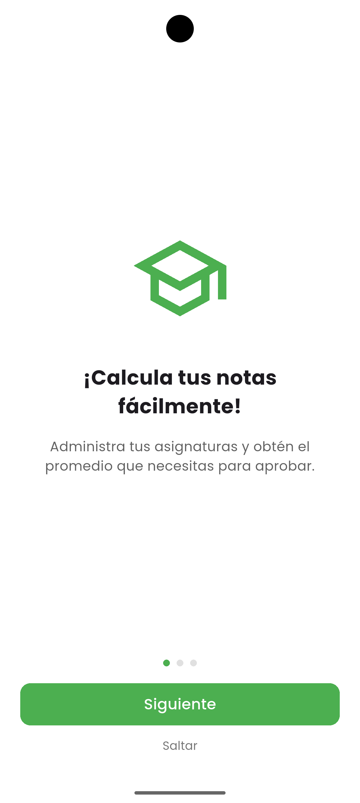
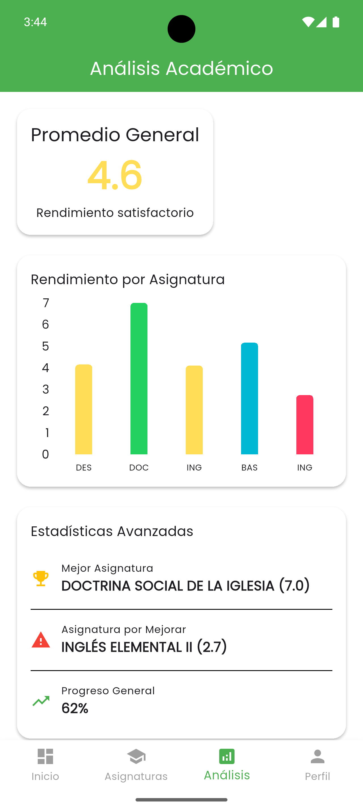
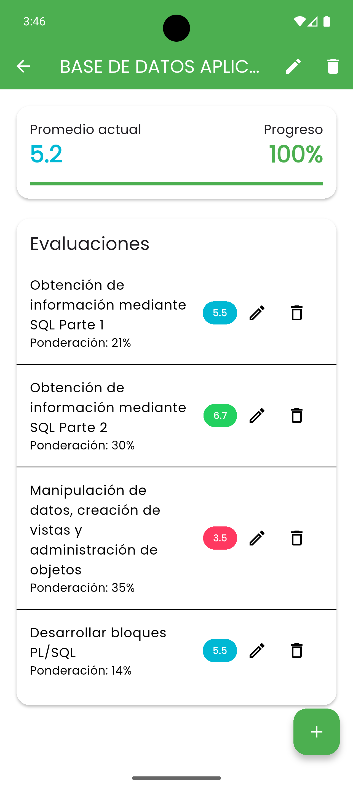

<div align="center">

# 📱 Calculadora de Notas


[](https://github.com/Nachovn114/Calcular_Notas_App/actions)
[](https://opensource.org/licenses/MIT)
[](https://flutter.dev)
[](https://github.com/Nachovn114/Calcular_Notas_App/stargazers)

## 🎯 La forma más inteligente de gestionar tus notas académicas

Una aplicación móvil moderna que revoluciona la manera de calcular y gestionar tus calificaciones. Diseñada con Flutter y Material Design 3 para ofrecer la mejor experiencia de usuario.

<div style="display: flex; justify-content: center; gap: 20px; margin: 20px 0;">
  <a href="https://github.com/Nachovn114/Calcular_Notas_App/releases" style="text-decoration: none;">
    📥 Descargar App
  </a>
  <a href="https://github.com/Nachovn114/Calcular_Notas_App/wiki" style="text-decoration: none;">
    📖 Documentación
  </a>
  <a href="https://github.com/Nachovn114/Calcular_Notas_App/issues" style="text-decoration: none;">
    🐛 Reportar Bug
  </a>
</div>

</div>

## ✨ Características Destacadas

<div align="center">
  
</div>

### 📊 Dashboard Inteligente
- **Visualización en Tiempo Real** de tu rendimiento académico
- **Análisis Predictivo** de tus calificaciones futuras
- **Gráficos Interactivos** para mejor comprensión

### 🎨 Diseño Premium
- **Tema Claro/Oscuro** automático
- **Interfaz Minimalista** y moderna
- **Animaciones Fluidas** para mejor experiencia

### 🔒 Seguridad y Privacidad
- **Almacenamiento Local** seguro
- **Sin Registro Requerido**
- **Datos Privados** siempre en tu control

## 📱 Vista Previa

<div align="center">
  <table>
    <tr>
      <td></td>
      <td></td>
      <td></td>
    </tr>
    <tr>
      <td align="center"><b>Onboarding</b></td>
      <td align="center"><b>Análisis</b></td>
      <td align="center"><b>Detalles</b></td>
    </tr>
  </table>
</div>

## 🚀 Instalación Rápida

```bash
# Clonar el repositorio
git clone https://github.com/Nachovn114/Calcular_Notas_App.git

# Instalar dependencias
flutter pub get

# Ejecutar la aplicación
flutter run
```

## 🛠️ Tecnologías Utilizadas

<div align="center">
  <table>
    <tr align="center">
      <td width="33%">
        
        <br>
        <strong>Flutter 3.2.3</strong>
        <br>
        <sub>Framework de UI</sub>
      </td>
      <td width="33%">
        
        <br>
        <strong>Dart</strong>
        <br>
        <sub>Lenguaje de programación</sub>
      </td>
      <td width="33%">
        
        <br>
        <strong>Provider</strong>
        <br>
        <sub>Gestión de estado</sub>
      </td>
    </tr>
    <tr align="center">
      <td>
        
        <br>
        <strong>Material Design 3</strong>
        <br>
        <sub>Sistema de diseño</sub>
      </td>
      <td>
        
        <br>
        <strong>FL Chart</strong>
        <br>
        <sub>Visualización de datos</sub>
      </td>
      <td>
        
        <br>
        <strong>Firebase</strong>
        <br>
        <sub>Backend y analíticas</sub>
      </td>
    </tr>
  </table>
</div>

### ⚡ Características principales:

- **Framework moderno** - Desarrollado con Flutter 3.2.3
- **Arquitectura robusta** - Patrón Provider para gestión de estado
- **Visualización avanzada** - Gráficos interactivos con FL Chart
- **Diseño atractivo** - Material Design 3 con temas personalizados
- **Backend escalable** - Integración con Firebase
- **Código optimizado** - Dart con las mejores prácticas

## 📬 Contacto y Redes Sociales

¿Tienes preguntas, sugerencias o te gustaría colaborar? ¡No dudes en contactarme!

[](https://github.com/Nachovn114)
[](https://www.linkedin.com/in/ignacio-valeria)
[](https://mail.google.com/mail/?view=cm&fs=1&to=ignaciovn11@gmail.com)

## ⭐ ¡Apoya el Proyecto!

Si encuentras útil este proyecto:

- ⭐ Dale una estrella
- 🔄 Comparte con otros estudiantes
- 📝 Deja tu feedback
- 🤝 Contribuye al desarrollo

<div align="center">

### 📊 Estadísticas del Proyecto

[](https://github.com/Nachovn114/Calcular_Notas_App/graphs/contributors)
[](https://github.com/Nachovn114/Calcular_Notas_App/issues)
[](https://github.com/Nachovn114/Calcular_Notas_App/pulls)

</div>

---

<div align="center">
  <sub>Construido con ❤️ por <a href="https://github.com/Nachovn114">Ignacio Valeria</a></sub>
</div> 