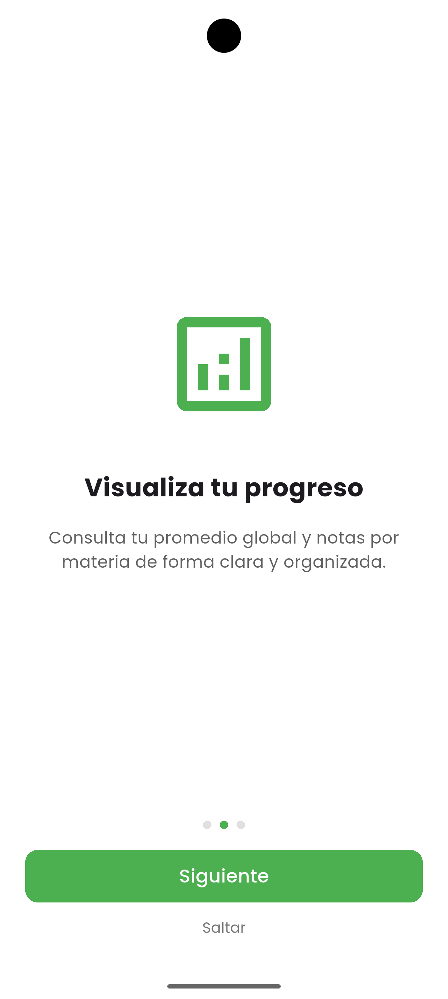
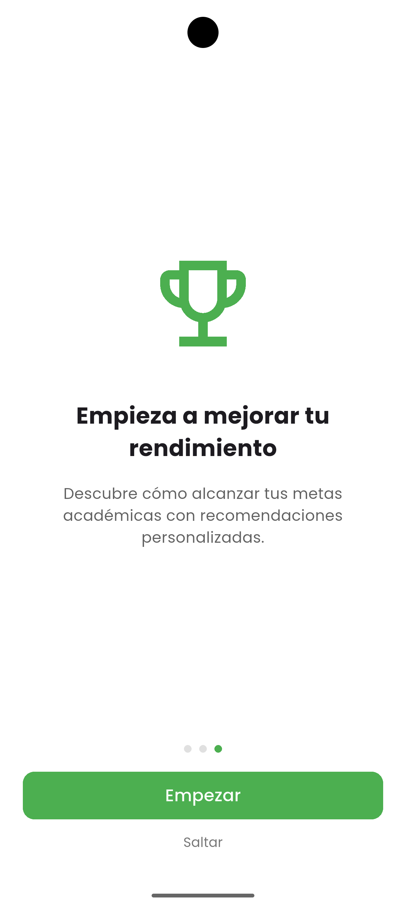

# 📚 Calculadora de Notas

Una aplicación móvil desarrollada con Flutter para ayudar a estudiantes a gestionar y calcular sus notas académicas.

## ✨ Características

### 📊 Dashboard
- Vista general del rendimiento académico
- Promedio general con indicador visual
- Visualización de mejor y peor asignatura
- Gráfico de rendimiento por categorías
- Interfaz limpia y moderna

### 📝 Gestión de Asignaturas
- Agregar, editar y eliminar asignaturas
- Registro de notas por asignatura
- Cálculo automático de promedios
- Seguimiento del progreso por asignatura

### 📈 Análisis Académico
- Estadísticas detalladas del rendimiento
- Gráfico de barras comparativo
- Identificación de fortalezas y áreas de mejora
- Recomendaciones personalizadas
- Cálculo de nota necesaria para aprobar (examen transversal 40%)

### 👤 Perfil y Configuración

La aplicación ofrece una interfaz limpia y sencilla para gestionar tu perfil y preferencias:

#### Características principales:

- **Perfil de Usuario**
  - Información básica del estudiante
  - Identificación del nivel académico
  - Avatar personalizable
  - Estado académico actual

- **Preferencias de Aplicación**
  - Activación/desactivación de notificaciones
  - Cambio entre tema claro y oscuro
  - Configuración de respaldo automático
  - Navegación intuitiva con iconos descriptivos

- **Soporte y Ayuda**
  - Acceso a la guía de ayuda
  - Información "Acerca de" la aplicación
  - Opción para reiniciar el tutorial
  - Centro de soporte integrado

- **Seguridad**
  - Opción de cerrar sesión
  - Gestión de datos personales
  - Control de privacidad
  - Respaldo seguro de información

#### Capturas de pantalla:

<div align="center">
  
  
</div>

_La sección de perfil muestra un diseño adaptativo con soporte para tema claro y oscuro, ofreciendo una experiencia de usuario consistente y accesible._

### 🎯 Onboarding
- Tutorial interactivo de 3 pasos
- Introducción a las funcionalidades principales
- Diseño moderno con iconografía intuitiva
- Opción para saltar o reiniciar el tutorial

### 📚 Gestión de Asignaturas

La aplicación permite una gestión completa de tus asignaturas y evaluaciones:

#### Características principales:

- **Vista general de asignaturas**
  - Lista ordenada de todas tus asignaturas
  - Promedio actual y progreso por asignatura
  - Indicador visual del rendimiento (código de colores)
  - Número de evaluaciones registradas
  - Notas de exámenes transversales cuando aplican

- **Creación de asignaturas**
  - Nombre personalizado
  - Definición de nota mínima deseada
  - Sistema de escala 1.0 - 7.0

- **Gestión de evaluaciones**
  - Registro detallado de cada evaluación
  - Sistema de ponderaciones flexible
  - Cálculo automático de promedios
  - Opciones de edición y eliminación
  - Control del peso disponible restante

#### Capturas de pantalla:


## 🛠️ Tecnologías Utilizadas

- Flutter
- Provider (Gestión de estado)
- SharedPreferences (Persistencia local)
- FL Chart (Visualización de datos)
- Google Fonts
- Material Design 3

## 📱 Capturas de Pantalla

### 🎯 Tutorial de Bienvenida
<div align="center">
  
  
  
</div>

### 📊 Dashboard y Análisis
<div align="center">
  
  
</div>

_Dashboard: Vista general con promedio global (4.6), mejor y peor asignatura, y distribución por categorías._

_Análisis: Estadísticas detalladas con gráfico de rendimiento por asignatura y métricas de progreso._

### Gestión de Asignaturas
<div align="center">
  
  
  
</div>

### Perfil y Configuración
<div align="center">
  
  
</div>

## 🚀 Instalación

1. Clona el repositorio:
```bash
git clone https://github.com/tu-usuario/calculadora-notas.git
```

2. Instala las dependencias:
```bash
flutter pub get
```

3. Ejecuta la aplicación:
```bash
flutter run
```

## 📋 Requisitos

- Flutter SDK
- Dart SDK
- Android Studio / VS Code
- Dispositivo Android/iOS o emulador

## 🤝 Contribuir

Las contribuciones son bienvenidas. Para cambios importantes:

1. Haz fork del repositorio
2. Crea una nueva rama
3. Realiza tus cambios
4. Envía un pull request

## 📄 Licencia

Este proyecto está bajo la Licencia MIT - ver el archivo [LICENSE](LICENSE) para más detalles.

## ✍️ Autor

[Tu nombre/usuario]

## 🙏 Agradecimientos

- A la comunidad Flutter
- A todos los contribuidores
- A los usuarios por su feedback 